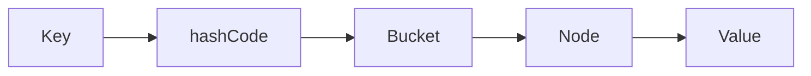

# Java Backend Engineering Handbook

## Project Specification

# PART 2 — Quy chuẩn của mỗi Chapter

> **Mục tiêu của Part 2**
>
> Đây là "DNA" của toàn bộ handbook.
>
> Tất cả các chapter từ Chapter 1 đến chương cuối cùng đều **phải tuân theo specification này**.
>
> Nếu sau này có AI khác hoặc người khác tiếp tục viết handbook thì cũng phải tuân theo đúng tài liệu này.

---

# 1. Một chapter KHÔNG phải là một bài blog

Một chapter cũng không phải là

* FAQ
* Tutorial
* Q&A
* Cheat Sheet

Một chapter phải giống một **chương sách kỹ thuật**.

Nghĩa là:

```
Có mở đầu

↓

Có dẫn dắt

↓

Có giải thích

↓

Có minh họa

↓

Có ví dụ

↓

Có ứng dụng thực tế

↓

Có tổng kết
```

---

# 2. Template chuẩn của một Chapter

Mọi chapter đều phải theo cùng một cấu trúc.

```text
Story

↓

Question

↓

Objectives

↓

Prerequisites

↓

Used Later

↓

Problem

↓

Concept

↓

Why

↓

How

↓

Visualization

↓

Example

↓

Deep Dive

↓

Production

↓

Debug

↓

Best Practice

↓

Summary

↓

Interview

↓

Exercises

↓

Cheat Sheet
```

Không được tự ý thay đổi thứ tự nếu không có lý do đặc biệt.

---

# 3. Story (Mở đầu)

Đây là phần quan trọng nhất.

Một chapter không được mở đầu bằng định nghĩa.

Ví dụ KHÔNG nên:

> HashMap là một implementation của Map.

Mà nên:

```
Giả sử bạn có 10 triệu User.

Bạn muốn tìm User theo id.

Bạn sẽ làm thế nào?

↓

Array?

↓

List?

↓

HashMap?
```

Sau đó mới giải thích HashMap.

---

Ví dụ String.

Không mở đầu bằng

> String là gì?

Mà

```
Nếu String mutable

↓

HashMap sẽ hỏng

↓

Security sẽ hỏng

↓

ClassLoader sẽ hỏng

↓

Điều gì xảy ra?
```

---

# 4. Objectives

Ngay đầu chapter phải nói rõ.

Ví dụ.

```
Sau chapter này bạn sẽ:

✓ hiểu HashMap

✓ hiểu Collision

✓ hiểu Resize

✓ hiểu Treeify

✓ debug HashMap
```

---

# 5. Prerequisites

Người đọc cần biết gì trước.

Ví dụ.

```
Prerequisites

✓ Object

✓ equals()

✓ hashCode()

✓ Array
```

---

# 6. Used Later

Đây là phần rất nhiều sách không có.

Ví dụ.

```
Kiến thức chapter này sẽ dùng ở

✓ HashMap

✓ ConcurrentHashMap

✓ Hibernate

✓ Spring Cache
```

Người đọc sẽ biết

"Tại sao mình học chapter này?"

---

# 7. Interview Question

Mỗi chapter phải có

"Câu hỏi trung tâm"

Ví dụ.

```
Tại sao HashMap nhanh?
```

hoặc

```
Tại sao Java cần JVM?
```

Toàn bộ chapter phải xoay quanh việc trả lời câu hỏi này.

---

# 8. Problem

Đầu tiên phải nêu vấn đề.

Ví dụ.

```
Có

10 triệu User

↓

Tìm User theo id

↓

Làm sao nhanh nhất?
```

---

# 9. Concept

Đây mới bắt đầu giải thích.

Không giải thích trước khi người đọc hiểu vấn đề.

---

# 10. Why?

Không được thiếu.

Ví dụ.

```
HashMap

↓

Tại sao cần?

↓

Nếu không có thì sao?
```

---

# 11. How?

Giải thích cách hoạt động.

Ví dụ.

```
hashCode()

↓

spread()

↓

bucket

↓

collision

↓

tree

↓

resize
```

---

# 12. Visualization

Đây là điểm khác biệt của handbook.

Mỗi khái niệm nên có hình.

Ưu tiên

ASCII

Ví dụ.

```
Bucket

0

1

2 ---> UserA

3 ---> UserB

4
```

Nếu phức tạp

dùng Mermaid.

Ví dụ.



---

# 13. Ví dụ Code

Code phải chạy được.

Không dùng pseudo code.

Ví dụ.

```java
Map<String,Integer> map = new HashMap<>();

map.put("A",1);

System.out.println(map.get("A"));
```

---

# 14. Deep Dive

Đây là phần handbook sẽ hơn tài liệu khác.

Ví dụ.

HashMap.

Không chỉ nói

```
put()
```

Mà

```
put()

↓

putVal()

↓

resize()

↓

treeifyBin()
```

Giải thích source.

---

Ví dụ Spring.

```
@Transactional

↓

Proxy

↓

TransactionInterceptor
```

---

# 15. Engineering Insight ⭐⭐⭐⭐⭐

Đây là phần mới.

Ví dụ.

```
Tại sao HashMap

không thread-safe?
```

Hay.

```
Tại sao

ConcurrentHashMap

không dùng synchronized toàn bộ?
```

Hay.

```
Tại sao

load factor = 0.75?
```

Đây là nơi giải thích tư duy thiết kế.

---

# 16. Historical Note

Nếu phù hợp.

Ví dụ.

```
Java 7

↓

LinkedList

↓

Java 8

↓

Red Black Tree
```

Hoặc.

```
PermGen

↓

Metaspace
```

Giúp người đọc hiểu vì sao Java thay đổi.

---

# 17. Myth vs Reality

Ví dụ.

```
Myth

HashMap luôn O(1)

Reality

Worst Case O(n)
```

Hay.

```
Myth

Java chậm.

Reality

JIT rất nhanh.
```

---

# 18. Common Mistakes

Ví dụ.

```
equals()

override

↓

quên hashCode()

↓

HashMap lỗi
```

Hay.

```
Optional

dùng làm field

↓

không nên
```

---

# 19. Best Practices

Ví dụ.

```
Dùng constructor

để inject dependency

↓

không dùng field injection
```

---

# 20. Production Notes

Đây là phần cực kỳ quan trọng.

Template cố định.

```
Problem

↓

Symptoms

↓

Root Cause

↓

Debug

↓

Solution

↓

Prevention
```

Ví dụ.

```
API

10 giây

↓

Missing Index

↓

Explain Plan

↓

Fix
```

---

# 21. Debug Checklist

Ví dụ.

Transaction.

```
Không rollback

□ RuntimeException

□ Proxy

□ Self Invocation

□ rollbackFor

□ catch Exception
```

Ví dụ.

Hikari.

```
Connection Pool

□ Leak

□ maxPoolSize

□ timeout

□ long transaction
```

---

# 22. Source Code Walkthrough

Mỗi chapter quan trọng phải đọc source.

Ví dụ.

HashMap.

```
putVal()

↓

resize()

↓

afterNodeInsertion()
```

Spring.

```
DispatcherServlet

↓

HandlerAdapter

↓

Controller
```

Hibernate.

```
PersistenceContext

↓

EntityEntry

↓

Dirty Checking
```

---

# 23. References

Chỉ sử dụng nguồn chất lượng cao.

Ưu tiên:

* OpenJDK Source
* Java Language Specification (JLS)
* JVM Specification
* Spring Official Documentation
* Hibernate Official Documentation
* PostgreSQL Documentation
* Oracle Documentation
* Martin Fowler
* Effective Java
* Java Concurrency in Practice
* Designing Data-Intensive Applications

Không lấy định nghĩa từ các blog không rõ nguồn.

---

# 24. Tiêu chí hoàn thành một chapter

Một chapter chỉ được đánh dấu **DONE** khi đáp ứng tất cả các tiêu chí sau:

| Tiêu chí                       | Bắt buộc |
| ------------------------------ | -------- |
| Story mở đầu                   | ✅        |
| Objectives                     | ✅        |
| Prerequisites                  | ✅        |
| Used Later                     | ✅        |
| Concept                        | ✅        |
| Why / How                      | ✅        |
| Visualization                  | ✅        |
| Ví dụ code chạy được           | ✅        |
| Engineering Insight            | ✅        |
| Common Mistakes                | ✅        |
| Best Practices                 | ✅        |
| Production Notes (nếu phù hợp) | ✅        |
| Debug Checklist (nếu phù hợp)  | ✅        |
| Interview Questions            | ✅        |
| Coding Exercises               | ✅        |
| Cheat Sheet                    | ✅        |
| Chapter Summary                | ✅        |
| References                     | ✅        |

---

# 25. Hiệu chỉnh độ sâu theo Importance (bắt buộc phải áp dụng cùng Part 4 §3.1 và Part 3 §11)

> **Bổ sung v1.1** — sửa lỗi: bảng tiêu chí ở §24 áp mọi mục gần như bắt buộc cho **mọi**
> chapter, bất kể chapter đó Importance ★★ hay ★★★★★. Áp dụng nguyên văn sẽ khiến một
> chapter tham khảo như `IdentityHashMap` hay `Deque` tốn công viết ngang với `HashMap`
> hay `Transaction` — không thực tế và không đúng tinh thần "độ sâu" ở Part 3 §11.

Từ nay, mức độ bắt buộc của từng mục phụ thuộc **Importance** (Part 4 §3.1) của chapter đó.

| Mục trong Template | ★★★★★ / ★★★★ | ★★★ | ★★ / ★ |
| --- | --- | --- | --- |
| Story, Objectives, Prerequisites, Used Later | Bắt buộc | Bắt buộc | Bắt buộc |
| Problem, Concept, Why, How | Bắt buộc | Bắt buộc | Bắt buộc |
| Visualization, Example | Bắt buộc | Bắt buộc | Bắt buộc |
| Deep Dive | Bắt buộc | Tùy chọn | Bỏ qua |
| Engineering Insight | Bắt buộc | Tùy chọn | Bỏ qua |
| Historical Note | Tùy chọn (nếu có) | Tùy chọn | Bỏ qua |
| Myth vs Reality | Bắt buộc | Tùy chọn | Bỏ qua |
| Common Mistakes, Best Practices | Bắt buộc | Bắt buộc | Tùy chọn |
| Production Notes, Debug Checklist | Bắt buộc nếu chapter có liên quan Production | Tùy chọn | Bỏ qua |
| Source Code Walkthrough | Bắt buộc | Tùy chọn | Bỏ qua |
| Summary, Interview Questions, Exercises, Cheat Sheet, References | Bắt buộc | Bắt buộc | Bắt buộc |

Nguyên tắc: **không bao giờ được bỏ** Story / Concept / Example / Interview Questions /
Summary dù chapter thuộc mức nào — đây là phần tối thiểu để một chapter còn giữ được tinh
thần "không phải cheat sheet" (Part 2 §1). Các mục "Bỏ qua" ở cột ★★/★ có thể được thêm lại
nếu tác giả thấy chủ đề đó thực sự có insight đáng viết.

---

## Kết thúc Part 2
